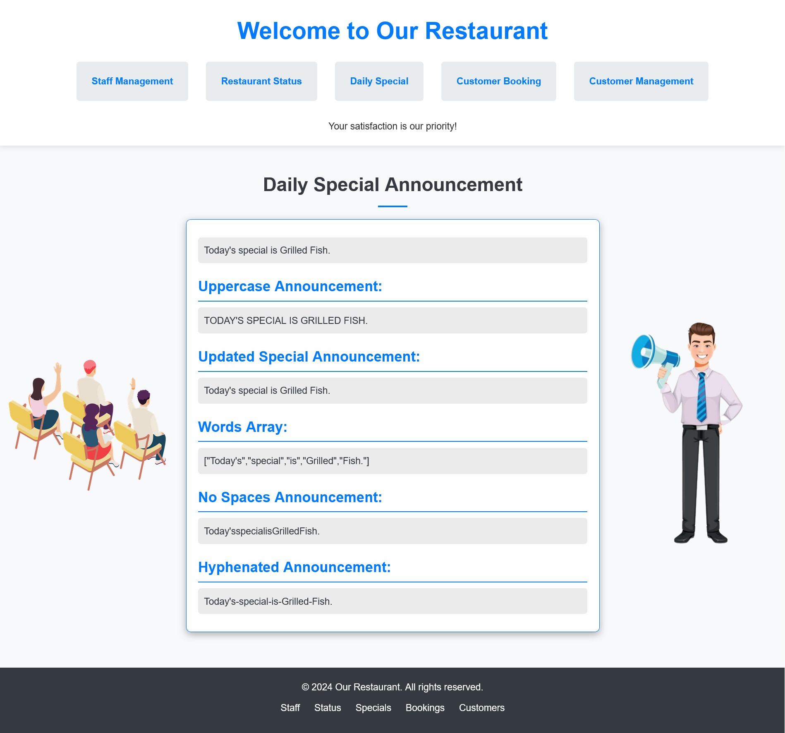

# Staff Dish Booking Management
A comprehensive web application for managing staff roles, dishes, and table bookings for a restaurant. This project includes functionalities for adding, editing, and deleting staff roles and dishes, checking the restaurant's operating status, managing daily specials, and tracking customer bookings.

## Features

- **Staff Role Management**: 
  - Add, edit, and delete unique staff roles.
  - Real-time display of the total number of unique roles.

- **Dish Management**: 
  - Add, edit, and delete dishes with validation for names (no special characters or numbers).
  - Display available dishes dynamically.

- **Restaurant Status Checking**: 
  - Input opening, closing, and current times to determine if the restaurant is open or closed.

- **Daily Specials**: 
  - Manage and display daily specials with various string manipulations (uppercase, updated text, word splitting, etc.).

- **Booking Tracker**: 
  - A robust system to manage customer table bookings, including add, edit, and delete functionalities.
  - Input validation to ensure proper customer names and prevent duplicates.

- **Customer Results Generation**: 
  - Generate personalized greetings, filter customer names, calculate total characters, and reverse the list of customer names.

## Topics

- Web Development
- JavaScript
- HTML
- CSS
- Frontend Development
- Restaurant Management
- User Interface
- Customer Management
- Application Development

## Screenshots

Here are some screenshots of the application:

### Website Home Page 


### Staff Role Management


### Dish Management


### Restaurant Status Check


### Daily Specials


### Booking Tracker


## Installation

1. Clone the repository:
   ```bash
   git clone https://github.com/MoSalem149v2/staff-dish-booking-management_DEBI-Task.git
